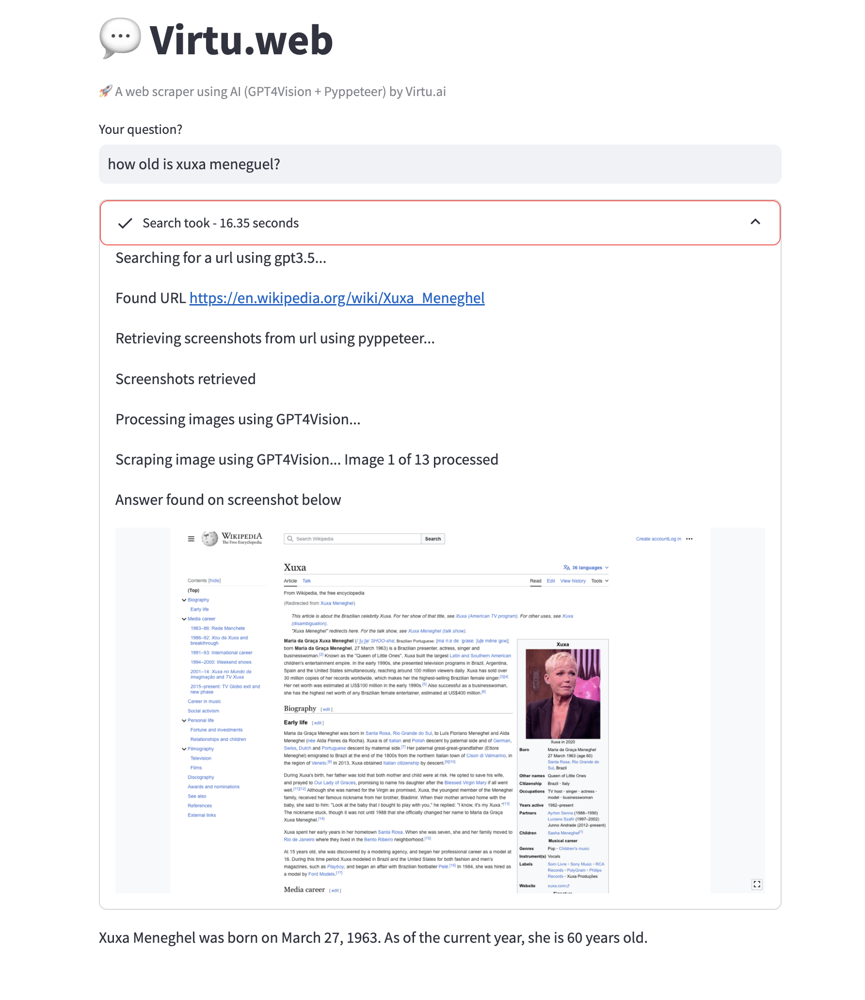

# Virtu.web

[](https://virtu-web.streamlit.app/)

**Virtu.web** a POC on how to use pyperteer + GPTVision to scrape pages and return real time information

[](https://www.buymeacoffee.com/rfonseca85)





## Installation

To run Virtu.web using Docker, follow these steps:

1. Clone the repository to your local machine.

2. Navigate to the project directory.

3. Build the Docker image (replace `virtu-web` with your desired image name):

   - Use the following command to build the Docker image:

     ```
     docker build -t virtu-web .
     ```

4. Run the Docker container (mapping port 8501 to your host machine):

   - Use the following command to run the Docker container:

     ```
     docker run -p 8501:8501 virtu-web
     ```

   Virtu.jira will be accessible at `http://localhost:8501` in your web browser.


## License

This project is licensed under the MIT License - see the [LICENSE](LICENSE) file for details.

---

Thank you for using Virtu.web! If you have any questions or encounter issues, please don't hesitate to [open an issue](https://github.com/rfonseca85/virtu-web/issues). Your feedback and contributions are greatly appreciated.